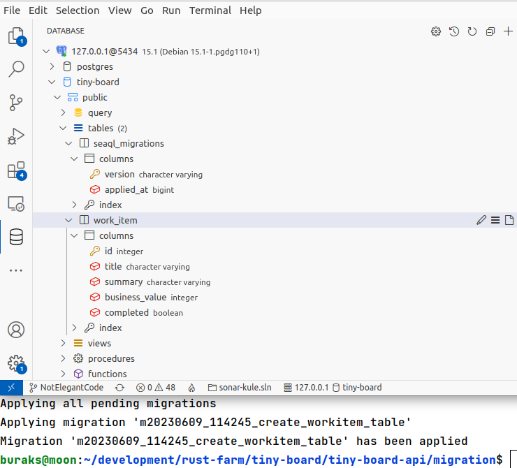

# Tiny-Board

Bu örnekte amacım Rust, Actix, SeaORM ve Electron kullanılarak basit bir todo uygulaması geliştirmeye çalışmak. Örneği takip ettiğim [Udemy](https://www.udemy.com/course/build-a-todolist-with-actix-web-rust-and-electron-vue) kursundan esinlenerek geliştirmeye çalışıyorum.

## Database

Örnekte PostgreSQL kullanılmakta. Ben her zamanki gibi docker imajını tercih edeceğim.

```bash
sudo docker run -p 5434:5432 --name tinyboard -e POSTGRES_PASSWORD=tiger -d postgres
```

Buna göre uygulamanın veritabanı bağlantısını da tutan .env dosyasında aşağıdaki tanımı kullanmamız yeterli olacak.

```.env
DATABASE_URL=postgres://localhost:5434/tiny-board?user=postgres&password=tiger
```

## Rust Projesinin Oluşturulması

İlk olarak rust projesini oluşturuyoruz.

```bash
cargo new tiny-board-api
cd tiny-board-api

# Gerekli küfeler(crates) yüklenir
# Servis arayüzü ve CORS izinleri için Actix, 
# Ortam parametrelerini kullanabilmek için dotnev
# loglama için env_logger ve log

cargo add actix-web actix-cors dotenv serde_json env_logger log futures

# ORM aracı olarak da SeaORM
# ki örnekte postgresql kullanılıyor, asenkron çalışma zamanı içinse actix-runtime
cargo add sea-orm -F sqlx-postgres,runtime-actix-native-tls,macros

# ???
cargo add async-std -F attributes,tokio1

# json serileştirme desteği için standart serde
cargo add serde -F derive

# ???
cargo add tracing-subscriber -F env-filter
```

_**Not:** cargo.toml dosyasına eklenen bazı crate'ler için feature bildirilmleri söz konusu. Bu, ilgili crate'in hangi özelliklerinin aktifleştirileceği anlamına gelir. Yani sadece ihtiyacımız olan özellikleri alıp gereksiz bağımlılıklarının indirilmemesini sağlar._

## Migration İşlemleri

Pekçok ORM aracında olduğu gibi (diesel mesela) SeaORM için de migration işlerini kolaylaştıran bir tool var. Önce bunu sisteme yüklüyoruz.

```bash
cargo install sea-orm-cli

# istemci aracı kurduktan sonra aşağıdaki komut çalıştırılır
sea-orm-cli migrate init
```

Bu işlem migration isimli bir klasörün oluşturulmasını sağlar. İçerisinde yine bir rust kütüphanesi yer alır. Tablo tanımlamalarını, göç planlarını burada ayarlarız. Bu tabii geliştirme ortamı için de bir bağımlılıktır bu nedenle cargo.toml'a aşağıdaki dependencies bildiriminin de eklenmesi gerekir.

```toml
migration = { path = "migration" }

[dependencies.sea-orm-migration]
version = "^0"
features = [
    "runtime-actix-native-tls",
    "sqlx-postgres"
]
```

Bundan sonra ilk migration planını hazırlayabiliriz. Örneğin workitem tablosunun oluşturulması söz konusu olabilir.

```bash
sea-orm-cli migrate generate create_workitem_table
```

Oluşan dosyada tablo için gerekli alan bildirimleri yapıldıktan ve .env içeriği ayarlandıktan sonra migration klasörü altındayken cargo run ile planın yürütülmesi sağlanabilir.

```bash
cd migration
cargo run
```

Ben docker üzerinden başlattığım Postgresql örneğinde tiny-board isimli bir veritabanı oluşturmuştum. Dolayısıyla migration plan çalıştıktan sonra WorkItem tablosu burada üretildi. Ayrıca migration planlarına ait seaql_migrations isimli bir tablo da eklendi.



## Entity Oluşturma

Yukarıdaki işlemler bir migration planını işletip postgresql tarafında work_item isimli tablonun oluşturulmasını sağlamıştır. Yine sea-orm-cli aracını kullanarak bu tabloya karşılık gelecek entity veri yapısını da kolayca üretebiliriz. Proje ana klasörüne çıktıktan sonra aşağıdaki komutla ilerlenebilir.

```bash
cd ..
sea-orm-cli generate entity -o src/entity
```

Bu komut src/entity klasörü içerisinde work_item isimli veri yapısının oluşturulmasını sağlayacaktır. Elebette birden fazla tablo olması halinde her biri için birer entity modeli üretilir.